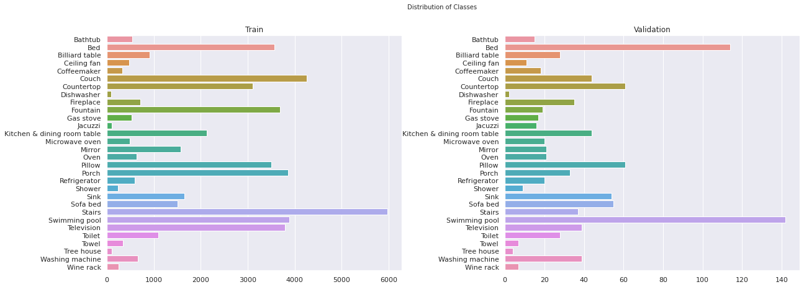

# Amenity Detection YOLOv7 Video Analytics

- [Amenity Detection YOLOv7 Video Analytics](#amenity-detection-yolov7-video-analytics)
  - [Overview](#overview)
  - [Dataset description](#dataset-description)
  - [References:](#references)

## Overview

https://user-images.githubusercontent.com/17452684/196499102-5f0be047-8640-4292-a501-b4db3cfc8fa2.mp4


## Dataset description

Google's public available Open Images V5 has been used which contains 15.4M annotated bounding boxes for over 600 object categories. It has 1.9M images and is largest among all existing datasets with object location annotations. The classes include a variety of objects in various categories. It covers classes varying from different kinds of musical instruments(e.g. organ, cello, piano etc.) to different kinds of aquatic animals(e.g. goldfish, crab, seahorse, oyster etc.) to various kinds of kitchenware(e.g. spoon, kitchen knife, frying pan, dishwasher) and so on.

Since our focus is on animitey detection, I filtered out images corresponding to objects that don't fall in this category. Below are choosen subset of classes that relate most to Airnb business.

```py
{
'Bathtub',
 'Bed',
 'Billiard table',
 'Ceiling fan',
 'Coffeemaker',
 'Couch',
 'Countertop',
 'Dishwasher',
 'Fireplace',
 'Fountain',
 'Gas stove',
 'Jacuzzi',
 'Kitchen & dining room table',
 'Microwave oven',
 'Mirror',
 'Oven',
 'Pillow',
 'Porch',
 'Refrigerator',
 'Shower',
 'Sink',
 'Sofa bed',
 'Stairs',
 'Swimming pool',
 'Television',
 'Toilet',
 'Towel',
 'Tree house',
 'Washing machine',
 'Wine rack'
}
```

This article nicely expalins download procedure in detail 
https://www.learnopencv.com/fast-image-downloader-for-open-images-v4/

**Classes distribution in Train and Test sets**



## References:
Airnb  project article: https://medium.com/airbnb-engineering/amenity-detection-and-beyond-new-frontiers-of-computer-vision-at-airbnb-144a4441b72e

Detectron2: https://github.com/facebookresearch/detectron2

Data Download: https://www.learnopencv.com/fast-image-downloader-for-open-images-v4/


Experiment tracking: https://lambdalabs.com/blog/weights-and-bias-gpu-cpu-utilization/

Data Augumentation: https://medium.com/@lessw/state-of-the-art-object-detection-use-these-top-3-data-augmentations-and-google-brains-optimal-57ac6d8d1de5#:~:text=The%20top%203%20augmentations%20used,bounding%20box%20size%20must%20increase.

